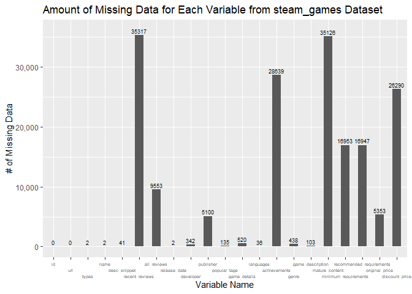
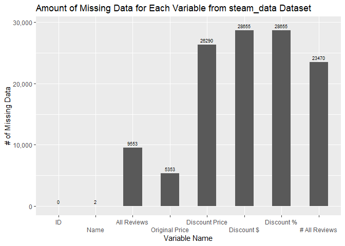
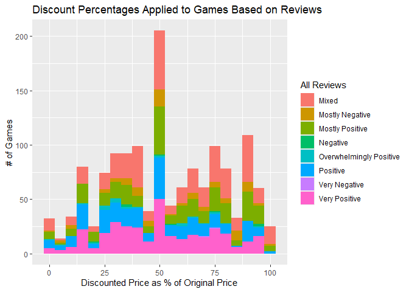
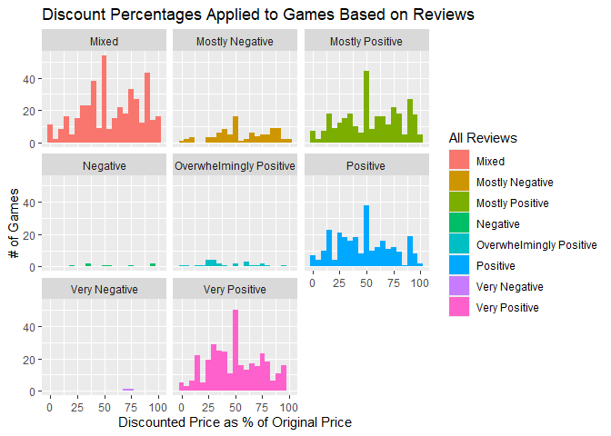

# Welcome to your (maybe) first-ever data analysis project!

And hopefully the first of many. Let’s get started:

1.  Install the [`datateachr`](https://github.com/UBC-MDS/datateachr)
    package by typing the following into your **R terminal**:

<!-- -->

    install.packages("devtools")
    devtools::install_github("UBC-MDS/datateachr")

1.  Load the packages below.

<!-- -->

    library(datateachr)
    library(tidyverse)

    ## ── Attaching core tidyverse packages ──────────────────────── tidyverse 2.0.0 ──
    ## ✔ dplyr     1.1.4     ✔ readr     2.1.5
    ## ✔ forcats   1.0.0     ✔ stringr   1.5.2
    ## ✔ ggplot2   3.5.2     ✔ tibble    3.3.0
    ## ✔ lubridate 1.9.4     ✔ tidyr     1.3.1
    ## ✔ purrr     1.1.0     
    ## ── Conflicts ────────────────────────────────────────── tidyverse_conflicts() ──
    ## ✖ dplyr::filter() masks stats::filter()
    ## ✖ dplyr::lag()    masks stats::lag()
    ## ℹ Use the conflicted package (<http://conflicted.r-lib.org/>) to force all conflicts to become errors

1.  Make a repository in the <https://github.com/stat545ubc-2024>
    Organization. You can do this by following the steps found on canvas
    in the entry called [MDA: Create a
    repository](https://canvas.ubc.ca/courses/158528/pages/mda-create-a-repository).
    One completed, your repository should automatically be listed as
    part of the stat545ubc-2024 Organization.

# Instructions

## For Both Milestones

-   Each milestone has explicit tasks. Tasks that are more challenging
    will often be allocated more points.

-   Each milestone will be also graded for reproducibility, cleanliness,
    and coherence of the overall Github submission.

-   While the two milestones will be submitted as independent
    deliverables, the analysis itself is a continuum - think of it as
    two chapters to a story. Each chapter, or in this case, portion of
    your analysis, should be easily followed through by someone
    unfamiliar with the content.
    [Here](https://swcarpentry.github.io/r-novice-inflammation/06-best-practices-R.html)
    is a good resource for what constitutes “good code”. Learning good
    coding practices early in your career will save you hassle later on!

-   The milestones will be equally weighted.

## For Milestone 1

**To complete this milestone**, edit [this very `.Rmd`
file](https://raw.githubusercontent.com/UBC-STAT/stat545.stat.ubc.ca/master/content/mini-project/mini-project-1.Rmd)
directly. Fill in the sections that are tagged with
`<!--- start your work below --->`.

**To submit this milestone**, make sure to knit this `.Rmd` file to an
`.md` file by changing the YAML output settings from
`output: html_document` to `output: github_document`. Commit and push
all of your work to the mini-analysis GitHub repository you made
earlier, and tag a release on GitHub. Then, submit a link to your tagged
release on canvas.

**Points**: This milestone is worth 36 points: 30 for your analysis, and
6 for overall reproducibility, cleanliness, and coherence of the Github
submission.

# Learning Objectives

By the end of this milestone, you should:

-   Become familiar with your dataset of choosing
-   Select 4 questions that you would like to answer with your data
-   Generate a reproducible and clear report using R Markdown
-   Become familiar with manipulating and summarizing your data in
    tibbles using `dplyr`, with a research question in mind.

# Task 1: Choose your favorite dataset

The `datateachr` package by Hayley Boyce and Jordan Bourak currently
composed of 7 semi-tidy datasets for educational purposes. Here is a
brief description of each dataset:

-   *apt\_buildings*: Acquired courtesy of The City of Toronto’s Open
    Data Portal. It currently has 3455 rows and 37 columns.

-   *building\_permits*: Acquired courtesy of The City of Vancouver’s
    Open Data Portal. It currently has 20680 rows and 14 columns.

-   *cancer\_sample*: Acquired courtesy of UCI Machine Learning
    Repository. It currently has 569 rows and 32 columns.

-   *flow\_sample*: Acquired courtesy of The Government of Canada’s
    Historical Hydrometric Database. It currently has 218 rows and 7
    columns.

-   *parking\_meters*: Acquired courtesy of The City of Vancouver’s Open
    Data Portal. It currently has 10032 rows and 22 columns.

-   *steam\_games*: Acquired courtesy of Kaggle. It currently has 40833
    rows and 21 columns.

-   *vancouver\_trees*: Acquired courtesy of The City of Vancouver’s
    Open Data Portal. It currently has 146611 rows and 20 columns.

**Things to keep in mind**

-   We hope that this project will serve as practice for carrying our
    your own *independent* data analysis. Remember to comment your code,
    be explicit about what you are doing, and write notes in this
    markdown document when you feel that context is required. As you
    advance in the project, prompts and hints to do this will be
    diminished - it’ll be up to you!

-   Before choosing a dataset, you should always keep in mind **your
    goal**, or in other ways, *what you wish to achieve with this data*.
    This mini data-analysis project focuses on *data wrangling*,
    *tidying*, and *visualization*. In short, it’s a way for you to get
    your feet wet with exploring data on your own.

And that is exactly the first thing that you will do!

1.1 **(1 point)** Out of the 7 datasets available in the `datateachr`
package, choose **4** that appeal to you based on their description.
Write your choices below:

**Note**: We encourage you to use the ones in the `datateachr` package,
but if you have a dataset that you’d really like to use, you can include
it here. But, please check with a member of the teaching team to see
whether the dataset is of appropriate complexity. Also, include a
**brief** description of the dataset here to help the teaching team
understand your data.

<!-------------------------- Start your work below ---------------------------->

1: steam\_games  
2: flow\_sample  
3: vancouver\_trees  
4: apt\_buildings

<!----------------------------------------------------------------------------->

1.2 **(6 points)** One way to narrowing down your selection is to
*explore* the datasets. Use your knowledge of dplyr to find out at least
*3* attributes about each of these datasets (an attribute is something
such as number of rows, variables, class type…). The goal here is to
have an idea of *what the data looks like*.

*Hint:* This is one of those times when you should think about the
cleanliness of your analysis. I added a single code chunk for you below,
but do you want to use more than one? Would you like to write more
comments outside of the code chunk?

<!-------------------------- Start your work below ---------------------------->

    ### EXPLORE HERE ###

    # Indicate which dataset is being summarized.
    print("dataset = steam_games")

    ## [1] "dataset = steam_games"

    # Functions to find dataset attributes.
    steam_games %>%
      # Summary of the number of rows & columns, and names of columns.
      glimpse() %>%
      # Type of data
      class()

    ## Rows: 40,833
    ## Columns: 21
    ## $ id                       <dbl> 1, 2, 3, 4, 5, 6, 7, 8, 9, 10, 11, 12, 13, 14…
    ## $ url                      <chr> "https://store.steampowered.com/app/379720/DO…
    ## $ types                    <chr> "app", "app", "app", "app", "app", "bundle", …
    ## $ name                     <chr> "DOOM", "PLAYERUNKNOWN'S BATTLEGROUNDS", "BAT…
    ## $ desc_snippet             <chr> "Now includes all three premium DLC packs (Un…
    ## $ recent_reviews           <chr> "Very Positive,(554),- 89% of the 554 user re…
    ## $ all_reviews              <chr> "Very Positive,(42,550),- 92% of the 42,550 u…
    ## $ release_date             <chr> "May 12, 2016", "Dec 21, 2017", "Apr 24, 2018…
    ## $ developer                <chr> "id Software", "PUBG Corporation", "Harebrain…
    ## $ publisher                <chr> "Bethesda Softworks,Bethesda Softworks", "PUB…
    ## $ popular_tags             <chr> "FPS,Gore,Action,Demons,Shooter,First-Person,…
    ## $ game_details             <chr> "Single-player,Multi-player,Co-op,Steam Achie…
    ## $ languages                <chr> "English,French,Italian,German,Spanish - Spai…
    ## $ achievements             <dbl> 54, 37, 128, NA, NA, NA, 51, 55, 34, 43, 72, …
    ## $ genre                    <chr> "Action", "Action,Adventure,Massively Multipl…
    ## $ game_description         <chr> "About This Game Developed by id software, th…
    ## $ mature_content           <chr> NA, "Mature Content Description  The develope…
    ## $ minimum_requirements     <chr> "Minimum:,OS:,Windows 7/8.1/10 (64-bit versio…
    ## $ recommended_requirements <chr> "Recommended:,OS:,Windows 7/8.1/10 (64-bit ve…
    ## $ original_price           <dbl> 19.99, 29.99, 39.99, 44.99, 0.00, NA, 59.99, …
    ## $ discount_price           <dbl> 14.99, NA, NA, NA, NA, 35.18, 70.42, 17.58, N…

    ## [1] "spec_tbl_df" "tbl_df"      "tbl"         "data.frame"

    # Indicate which dataset is being summarized.
    print("dataset = flow_sample")

    ## [1] "dataset = flow_sample"

    # Functions to find dataset attributes.
    flow_sample %>%
      # Summary of the number of rows & columns, and names of columns.
      glimpse() %>%
      # Type of data
      class()

    ## Rows: 218
    ## Columns: 7
    ## $ station_id   <chr> "05BB001", "05BB001", "05BB001", "05BB001", "05BB001", "0…
    ## $ year         <dbl> 1909, 1910, 1911, 1912, 1913, 1914, 1915, 1916, 1917, 191…
    ## $ extreme_type <chr> "maximum", "maximum", "maximum", "maximum", "maximum", "m…
    ## $ month        <dbl> 7, 6, 6, 8, 6, 6, 6, 6, 6, 6, 6, 7, 6, 6, 6, 7, 5, 7, 6, …
    ## $ day          <dbl> 7, 12, 14, 25, 11, 18, 27, 20, 17, 15, 22, 3, 9, 5, 14, 5…
    ## $ flow         <dbl> 314, 230, 264, 174, 232, 214, 236, 309, 174, 345, 185, 24…
    ## $ sym          <chr> NA, NA, NA, NA, NA, NA, NA, NA, NA, NA, NA, NA, NA, NA, N…

    ## [1] "tbl_df"     "tbl"        "data.frame"

    # Indicate which dataset is being summarized.
    print("dataset = vancouver_trees")

    ## [1] "dataset = vancouver_trees"

    # Functions to find dataset attributes.
    vancouver_trees %>%
      # Summary of the number of rows & columns, and names of columns.
      glimpse() %>%
      # Type of data
      class()

    ## Rows: 146,611
    ## Columns: 20
    ## $ tree_id            <dbl> 149556, 149563, 149579, 149590, 149604, 149616, 149…
    ## $ civic_number       <dbl> 494, 450, 4994, 858, 5032, 585, 4909, 4925, 4969, 7…
    ## $ std_street         <chr> "W 58TH AV", "W 58TH AV", "WINDSOR ST", "E 39TH AV"…
    ## $ genus_name         <chr> "ULMUS", "ZELKOVA", "STYRAX", "FRAXINUS", "ACER", "…
    ## $ species_name       <chr> "AMERICANA", "SERRATA", "JAPONICA", "AMERICANA", "C…
    ## $ cultivar_name      <chr> "BRANDON", NA, NA, "AUTUMN APPLAUSE", NA, "CHANTICL…
    ## $ common_name        <chr> "BRANDON ELM", "JAPANESE ZELKOVA", "JAPANESE SNOWBE…
    ## $ assigned           <chr> "N", "N", "N", "Y", "N", "N", "N", "N", "N", "N", "…
    ## $ root_barrier       <chr> "N", "N", "N", "N", "N", "N", "N", "N", "N", "N", "…
    ## $ plant_area         <chr> "N", "N", "4", "4", "4", "B", "6", "6", "3", "3", "…
    ## $ on_street_block    <dbl> 400, 400, 4900, 800, 5000, 500, 4900, 4900, 4900, 7…
    ## $ on_street          <chr> "W 58TH AV", "W 58TH AV", "WINDSOR ST", "E 39TH AV"…
    ## $ neighbourhood_name <chr> "MARPOLE", "MARPOLE", "KENSINGTON-CEDAR COTTAGE", "…
    ## $ street_side_name   <chr> "EVEN", "EVEN", "EVEN", "EVEN", "EVEN", "ODD", "ODD…
    ## $ height_range_id    <dbl> 2, 4, 3, 4, 2, 2, 3, 3, 2, 2, 2, 5, 3, 2, 2, 2, 2, …
    ## $ diameter           <dbl> 10.00, 10.00, 4.00, 18.00, 9.00, 5.00, 15.00, 14.00…
    ## $ curb               <chr> "N", "N", "Y", "Y", "Y", "Y", "Y", "Y", "Y", "Y", "…
    ## $ date_planted       <date> 1999-01-13, 1996-05-31, 1993-11-22, 1996-04-29, 19…
    ## $ longitude          <dbl> -123.1161, -123.1147, -123.0846, -123.0870, -123.08…
    ## $ latitude           <dbl> 49.21776, 49.21776, 49.23938, 49.23469, 49.23894, 4…

    ## [1] "tbl_df"     "tbl"        "data.frame"

    # Indicate which dataset is being summarized.
    print("dataset = apt_buildings")

    ## [1] "dataset = apt_buildings"

    # Functions to find dataset attributes.
    apt_buildings %>%
      # Summary of the number of rows & columns, and names of columns.
      glimpse() %>%
      # Type of data
      class()

    ## Rows: 3,455
    ## Columns: 37
    ## $ id                               <dbl> 10359, 10360, 10361, 10362, 10363, 10…
    ## $ air_conditioning                 <chr> "NONE", "NONE", "NONE", "NONE", "NONE…
    ## $ amenities                        <chr> "Outdoor rec facilities", "Outdoor po…
    ## $ balconies                        <chr> "YES", "YES", "YES", "YES", "NO", "NO…
    ## $ barrier_free_accessibilty_entr   <chr> "YES", "NO", "NO", "YES", "NO", "NO",…
    ## $ bike_parking                     <chr> "0 indoor parking spots and 10 outdoo…
    ## $ exterior_fire_escape             <chr> "NO", "NO", "NO", "YES", "NO", NA, "N…
    ## $ fire_alarm                       <chr> "YES", "YES", "YES", "YES", "YES", "Y…
    ## $ garbage_chutes                   <chr> "YES", "YES", "NO", "NO", "NO", "NO",…
    ## $ heating_type                     <chr> "HOT WATER", "HOT WATER", "HOT WATER"…
    ## $ intercom                         <chr> "YES", "YES", "YES", "YES", "YES", "Y…
    ## $ laundry_room                     <chr> "YES", "YES", "YES", "YES", "YES", "Y…
    ## $ locker_or_storage_room           <chr> "NO", "YES", "YES", "YES", "NO", "YES…
    ## $ no_of_elevators                  <dbl> 3, 3, 0, 1, 0, 0, 0, 2, 4, 2, 0, 2, 2…
    ## $ parking_type                     <chr> "Underground Garage , Garage accessib…
    ## $ pets_allowed                     <chr> "YES", "YES", "YES", "YES", "YES", "Y…
    ## $ prop_management_company_name     <chr> NA, "SCHICKEDANZ BROS. PROPERTIES", N…
    ## $ property_type                    <chr> "PRIVATE", "PRIVATE", "PRIVATE", "PRI…
    ## $ rsn                              <dbl> 4154812, 4154815, 4155295, 4155309, 4…
    ## $ separate_gas_meters              <chr> "NO", "NO", "NO", "NO", "NO", "NO", "…
    ## $ separate_hydro_meters            <chr> "YES", "YES", "YES", "YES", "YES", "Y…
    ## $ separate_water_meters            <chr> "NO", "NO", "NO", "NO", "NO", "NO", "…
    ## $ site_address                     <chr> "65  FOREST MANOR RD", "70  CLIPPER R…
    ## $ sprinkler_system                 <chr> "YES", "YES", "NO", "YES", "NO", "NO"…
    ## $ visitor_parking                  <chr> "PAID", "FREE", "UNAVAILABLE", "UNAVA…
    ## $ ward                             <chr> "17", "17", "03", "03", "02", "02", "…
    ## $ window_type                      <chr> "DOUBLE PANE", "DOUBLE PANE", "DOUBLE…
    ## $ year_built                       <dbl> 1967, 1970, 1927, 1959, 1943, 1952, 1…
    ## $ year_registered                  <dbl> 2017, 2017, 2017, 2017, 2017, NA, 201…
    ## $ no_of_storeys                    <dbl> 17, 14, 4, 5, 4, 4, 4, 7, 32, 4, 4, 7…
    ## $ emergency_power                  <chr> "NO", "YES", "NO", "NO", "NO", "NO", …
    ## $ `non-smoking_building`           <chr> "YES", "NO", "YES", "YES", "YES", "NO…
    ## $ no_of_units                      <dbl> 218, 206, 34, 42, 25, 34, 14, 105, 57…
    ## $ no_of_accessible_parking_spaces  <dbl> 8, 10, 20, 42, 12, 0, 5, 1, 1, 6, 12,…
    ## $ facilities_available             <chr> "Recycling bins", "Green Bin / Organi…
    ## $ cooling_room                     <chr> "NO", "NO", "NO", "NO", "NO", "NO", "…
    ## $ no_barrier_free_accessible_units <dbl> 2, 0, 0, 42, 0, NA, 14, 0, 0, 1, 25, …

    ## [1] "tbl_df"     "tbl"        "data.frame"

<!----------------------------------------------------------------------------->

1.3 **(1 point)** Now that you’ve explored the 4 datasets that you were
initially most interested in, let’s narrow it down to 1. What lead you
to choose this one? Briefly explain your choice below.

<!-------------------------- Start your work below ---------------------------->

I will choose the steam\_games dataset. I like Steam and recognize some
of the games on the dataset’s summary. It also has a reasonable amount
of data. The flow\_sample dataset doesn’t have a lot of rows or columns,
so I think an analysis won’t be as interesting. Meanwhile,
vancouver\_trees has too many rows of data, so I worry graphs will be
more cluttered, not to mention the processing speed for my computer. The
apt\_buildings dataset has fewer rows, but there are a lot more columns
compared to the other datasets. It’s a lot of variables to keep track
of, and a lot of them are yes/no answers which I find boring.

<!----------------------------------------------------------------------------->

1.4 **(2 points)** Time for a final decision! Going back to the
beginning, it’s important to have an *end goal* in mind. For example, if
I had chosen the `titanic` dataset for my project, I might’ve wanted to
explore the relationship between survival and other variables. Try to
think of 1 research question that you would want to answer with your
dataset. Note it down below.

<!-------------------------- Start your work below ---------------------------->

Question: Does the community perception of how good a game is affect how
much a game’s price is discounted?

<!----------------------------------------------------------------------------->

# Important note

Read Tasks 2 and 3 *fully* before starting to complete either of them.
Probably also a good point to grab a coffee to get ready for the fun
part!

This project is semi-guided, but meant to be *independent*. For this
reason, you will complete tasks 2 and 3 below (under the **START HERE**
mark) as if you were writing your own exploratory data analysis report,
and this guidance never existed! Feel free to add a brief introduction
section to your project, format the document with markdown syntax as you
deem appropriate, and structure the analysis as you deem appropriate. If
you feel lost, you can find a sample data analysis
[here](https://www.kaggle.com/headsortails/tidy-titarnic) to have a
better idea. However, bear in mind that it is **just an example** and
you will not be required to have that level of complexity in your
project.

# Task 2: Exploring your dataset

If we rewind and go back to the learning objectives, you’ll see that by
the end of this deliverable, you should have formulated *4* research
questions about your data that you may want to answer during your
project. However, it may be handy to do some more exploration on your
dataset of choice before creating these questions - by looking at the
data, you may get more ideas. **Before you start this task, read all
instructions carefully until you reach START HERE under Task 3**.

2.1 **(12 points)** Complete *4 out of the following 8 exercises* to
dive deeper into your data. All datasets are different and therefore,
not all of these tasks may make sense for your data - which is why you
should only answer *4*.

Make sure that you’re using dplyr and ggplot2 rather than base R for
this task. Outside of this project, you may find that you prefer using
base R functions for certain tasks, and that’s just fine! But part of
this project is for you to practice the tools we learned in class, which
is dplyr and ggplot2.

1.  Plot the distribution of a numeric variable.
2.  Create a new variable based on other variables in your data (only if
    it makes sense)
3.  Investigate how many missing values there are per variable. Can you
    find a way to plot this?
4.  Explore the relationship between 2 variables in a plot.
5.  Filter observations in your data according to your own criteria.
    Think of what you’d like to explore - again, if this was the
    `titanic` dataset, I may want to narrow my search down to passengers
    born in a particular year…
6.  Use a boxplot to look at the frequency of different observations
    within a single variable. You can do this for more than one variable
    if you wish!
7.  Make a new tibble with a subset of your data, with variables and
    observations that you are interested in exploring.
8.  Use a density plot to explore any of your variables (that are
    suitable for this type of plot).

2.2 **(4 points)** For each of the 4 exercises that you complete,
provide a *brief explanation* of why you chose that exercise in relation
to your data (in other words, why does it make sense to do that?), and
sufficient comments for a reader to understand your reasoning and code.

<!-------------------------- Start your work below ---------------------------->
<!----------------------------------------------------------------------------->

# Task 3: Choose research questions

**(4 points)** So far, you have chosen a dataset and gotten familiar
with it through exploring the data. You have also brainstormed one
research question that interested you (Task 1.4). Now it’s time to pick
4 research questions that you would like to explore in Milestone 2!
Write the 4 questions and any additional comments below.

<!--- *****START HERE***** --->

## Introduction

This is an analysis of data surrounding games listed on the gaming
platform Steam. I will be using R to determine the possible relationship
between the reception of a game (the average rating given to it via
reviews) and the amount its price was discounted. My hypothesis is that
games that are poorly received, i.e: games that get negative reviews,
will be discounted more.

The analysis will use `tidyverse` packages. Mostly, the data
manipulation will use `dplyr` functions. I will also be generating plots
using `ggplot2`. The data set used, steam\_games, comes from the
`datateachr` library, found at <https://github.com/UBC-MDS/datateachr>.

## Methodology

To remove extraneous data that are unnecessary to the analysis, I will
create a new tibble, `steam_data`, which excludes unnecessary columns.
This will include the game’s `id` and `name`, which helps to identify
specifiic rows at a glance in the future if needed. It will also include
the `all_reviews` column, as well as the game’s `original_price` and
`discounted_price` columns.

I will determine the dollar amount that each game was discounted for by
subtracting `discounted_price` from `original_price`, creating
`discounted_dollar`. Next, I will determine by what percent the game was
discounted for by dividing `discounted_dollar` by the game’s
`original_price`, creating `discounted_percent`.

Third, I will extract the number of reviews and the average rating that
a game has from the `all_reviews`. The data in `all_reviews` consists of
a long string with information on the rating, number of reviews, and
percentage of people giving the game a certain rating. I will use the
`stringr` library’s functions to extract the number of reviews, listed
in parentheses, into `all_review_num`. This column is not used for this
analysis, but can be used later to determine sample size bias.

I will then replace the original `all_reviews` column with a column of
shorter strings of the audience rating. These ratings, ranging from
“Very Negative” to “Overwhelmingly Positive,” are the first phrases in
their original longer strings. They are separated from the rest of the
string with a comma, which makes them easy to extract.

Finally, I will rename the columns to be capitalized and more concise
where needed. The final `steam_data` tibble has 8 columns, listing the
aforementioned information. The code is shown below.

    # Use scales library to format number as a percent
    library(scales)

    ## 
    ## Attaching package: 'scales'

    ## The following object is masked from 'package:purrr':
    ## 
    ##     discard

    ## The following object is masked from 'package:readr':
    ## 
    ##     col_factor

    # Use stringr to extract specific snippets from review data
    library(stringr)

    # Exercise #7: Make a new tibble for the game name and ID, original price, discounted price, and all reviews.
    steam_data <- steam_games %>%
      select(id, name, all_reviews, original_price, discount_price) %>%
      
      # Exercise #2: Create new columns for data derived from prices and reviews.
      
      # New column for how many dollars each game was discounted for.
      mutate(discount_dollar = original_price - discount_price) %>%
      # New column for what percentage each game was discounted for.
      mutate(discount_percent = as.numeric(discount_dollar / original_price * 100)) %>%
      
      # New columns for numbers of all reviews
      mutate(all_review_num = as.numeric(gsub(",", "", 
                                              str_extract(all_reviews, 
                                                          "(?<=\\().*(?=\\))")))) %>%
      
      # New columns indicating just the average review rating
      mutate(all_reviews = gsub(",.*$", "", all_reviews)) %>%
      
      # Change column names
      rename("ID" = id, "Name" = name, "All Reviews" = all_reviews, 
             "Original Price" = original_price, "Discount Price" = discount_price,
             "Discount $" = discount_dollar, "Discount %" = discount_percent, 
             "# All Reviews" = all_review_num)
    steam_data

    ## # A tibble: 40,833 × 8
    ##       ID Name       `All Reviews` `Original Price` `Discount Price` `Discount $`
    ##    <dbl> <chr>      <chr>                    <dbl>            <dbl>        <dbl>
    ##  1     1 DOOM       Very Positive             20.0             15.0         5   
    ##  2     2 PLAYERUNK… Mixed                     30.0             NA          NA   
    ##  3     3 BATTLETECH Mostly Posit…             40.0             NA          NA   
    ##  4     4 DayZ       Mixed                     45.0             NA          NA   
    ##  5     5 EVE Online Mostly Posit…              0               NA          NA   
    ##  6     6 Grand The… NaN                       NA               35.2        NA   
    ##  7     7 Devil May… Very Positive             60.0             70.4       -10.4 
    ##  8     8 Human: Fa… Very Positive             15.0             17.6        -2.59
    ##  9     9 They Are … Very Positive             30.0             NA          NA   
    ## 10    10 Warhammer… Mixed                     50.0             NA          NA   
    ## # ℹ 40,823 more rows
    ## # ℹ 2 more variables: `Discount %` <dbl>, `# All Reviews` <dbl>

## Missing Values

Not every row of data has all the values needed for the analysis. For
example, Warhammer: Chaosbane and Team Sonic Racing were never
discounted. Meanwhile, Grand Theft Auto IV and Super Neptunia RPG never
got an audience review rating. Before I continue with the analysis, I
must determine the amount of data missing from each column. For the
purpose of future analyses, I will determine this for both the original
`steam_games` data set and the new `steam_data` data set.

I created a new tibble, `missing_summary`, which counted how many `NA`
values each column had and saved them into one row. Then I pivoted the
tibble, so that one column listed the column names of the `steam_games`
or `steam_data` tibble, and the other listed the number of `NA` values
in each column.

I created a bar chart using `ggplot2` to show the number of missing
values per column, as shown below. Out of the nearly 41 thousand rows of
data, about 26 thousand did not have discounts, and about 23 thousand
didn’t have sufficient reviews. This is over half the data set. In the
next step, where only rows with both discounts and reviews will be
taken, this will likely reduce the available data even further.

    # Exercise #3: Determine how many missing values there are per column.
    missing_summary <- steam_games %>%
      summarise(across(everything(), ~ sum(is.na(.)))) %>%
      
      #Pivot tibble to make two columns of variable names and # of NA's
      pivot_longer(cols = colnames(steam_games), values_to = "NAs")

    # Create bar chart showing number of missing values per column.
    ggplot(missing_summary, aes(x = name, y = NAs)) +
      geom_bar(stat = "identity", width = 0.5) +
      geom_text(size = 2.5, aes(label = NAs), nudge_y = 750) +
      
      # Format the axes
      scale_y_continuous(labels = comma) +
      scale_x_discrete(guide = guide_axis(n.dodge = 3), 
                       limits = missing_summary$name) +
      theme(axis.text.x = element_text(size = 5)) +
      labs(x = "Variable Name", y = "# of Missing Data") +
      
      # Add title
      ggtitle("Amount of Missing Data for Each Variable from steam_games Dataset")

    # Do the same as above but for the relevant data in steam_data
    missing_summary <- steam_data %>%
      summarise(across(everything(), ~ sum(is.na(.)))) %>%
      
      #Pivot tibble to make two columns of variable names and # of NA's
      pivot_longer(cols = colnames(steam_data), values_to = "NAs")

    # Create bar chart showing number of missing values per column.
    ggplot(missing_summary, aes(x = name, y = NAs)) +
      geom_bar(stat = "identity", width = 0.5) +
      geom_text(size = 2.5, aes(label = NAs), nudge_y = 750) +
      
      # Format the axes
      scale_y_continuous(labels = comma) +
      scale_x_discrete(guide = guide_axis(n.dodge = 2), 
                       limits = missing_summary$name) +
      labs(x = "Variable Name", y = "# of Missing Data") +
      
      # Add title
      ggtitle("Amount of Missing Data for Each Variable from steam_data Dataset")

## Histogram of Discounts

To determine if there’s a relationship between user reviews and the
amount a game is discounted, I created a histogram of the percentage a
game was discounted for. This required creating a new tibble,
`hist_data`, which simply included the `Discount %` and `All Reviews`
columns.

First, the tibble was filtered for rows that had all the necessary
information. This means any row with data missing in either column was
filtered out. Moreover, many of the discounted prices were significantly
higher than their original prices. While this is not impossible, the
scope of this analysis is to look at discounts as in lower prices. All
rows where the discount percentage is negative, meaning the discounted
price is higher than the original price, were filtered out.

Additionally, many games did not have sufficient reviews to come to a
consensus about the rating of the game. Therefore, the tibble was
filtered to only include review ratings that signal a positive,
negative, or mixed rating. All of this significantly reduces the number
of rows available for analysis - 1,434.

As this is significantly smaller than the 40,833 rows that I started out
with, it indicates that discounting games due to player reviews would
likely be rare, if not completely uncorrelated. Previous data indicates
that most games never get discounted in the first place. About a quarter
of games never get popular enough to get enough reviews for an audience
rating.

The filtered data was plotted as a stacked histogram, where the layers
were colored based on what rating the games received. The code to filter
data and plot the histogram are shown below.

    # Exercise 4: Explore relationship between all reviews rating and % discounted
    # Filter out all rows with missing data for relevant variables
    hist_data <- steam_data %>%
      select("Discount %", "All Reviews") %>%
      na.omit() %>%
      
      # Discount means lower price. Filter out all negative discount values.
      filter(`Discount %` >= 0) %>%
      # Filter out review ratings that do not indicate positive/negative/mixed opinions
      filter(str_detect(`All Reviews`, "Positive|Negative|Mixed")) %>%
      # Order the review ratings from most negative to most positive
      arrange(match(`All Reviews`, c("Very Negative", "Negative", "Mostly egative", 
                                     "Mixed", "Mostly Positive", "Positive",
                                     "Very Positive", "Overwhelmingly Positive")))
    hist_data

    ## # A tibble: 1,434 × 2
    ##    `Discount %` `All Reviews`
    ##           <dbl> <chr>        
    ##  1         75.2 Very Negative
    ##  2         68.9 Very Negative
    ##  3         75.4 Negative     
    ##  4         95.4 Negative     
    ##  5         95.4 Negative     
    ##  6         50.0 Negative     
    ##  7         55.3 Negative     
    ##  8         34.1 Negative     
    ##  9         32.6 Negative     
    ## 10         20.2 Negative     
    ## # ℹ 1,424 more rows

    # Create stacked histogram of discount percentages
    ggplot(hist_data, aes(x = `Discount %`, fill = `All Reviews`)) +
      geom_histogram(binwidth = 5, position = "stack") + 
      
      # Format axes and title
      labs(x = "Discounted Price as % of Original Price", y = "# of Games") +
      ggtitle("Discount Percentages Applied to Games Based on Reviews")

    # Create individual histogram of discount percentages
    ggplot(hist_data, aes(x = `Discount %`, fill = `All Reviews`)) +
      geom_histogram(binwidth = 5, position = "stack") +
      facet_wrap(~`All Reviews`) +
      
      # Format axes and title
      labs(x = "Discounted Price as % of Original Price", y = "# of Games") +
      ggtitle("Discount Percentages Applied to Games Based on Reviews")

## Results

The most common discount to apply to a game is 50%, regardless of
reviews. Discounts are also commonly set at around 15%, 40%, 75%, and
90%. There is no apparent correlation between the audience perception of
the game via reviews and the amount a game is discounted.

Negatively and overwhelmingly positively rated games do not appear to be
discounted as much. Perhaps this is because the games were so bad that
it was decided no one would play it regardless of the price, or the
games were so good it was decided everyone will still play it at full
price.

Meanwhile, middling games with ratings from mostly negative to very
positive were discounted more often. This is perhaps because, as the
reception seems to be more subjective, it was decided that people were
more likely to give these games a chance if they were cheaper. It’s also
possible that most games tend to be middling, so the ones that get
discounted tend to be middling as well.

## Conclusion

My hypothesis that negatively reviewed games are discounted by larger
amounts was disproven. While there is a possible correlation between a
game’s review and whether it gets discounted at all, there is no
apparent trend indicating that reviews affect *how much* a game is
discounted.

The plots generated in this analysis more likely reflects that average
spread of reviews across all games: very few games are rated extremely
positively or negatively, and most are middling in reception. The amount
that a game was discounted for then represents this spread evenly.

However, it was determined that a large amount of games received
discounts that were greater than their original prices. This could be
due to many external factors, but a potential future analysis could
examine if this had any correlation to audience reviews.

Additionally, the original `steam_games` data set contained other
variables in the game, including language options, computer
requirements, and genres, which could also inform the preferences of the
gaming industry. Based on this, I came up with the following four
research questions to inform future analyses.

1.  Why are so many of the discounted game prices higher than the
    non-discounted prices?
2.  How does the initial price of a game and its computer requirements
    affect its audience perception?
3.  Have discounts applied to games affected how they are reviewed
    recently compared to overall?
4.  What genre of games are the most popular to release and play over
    time?

<!----------------------------->

# Overall reproducibility/Cleanliness/Coherence Checklist

## Coherence (0.5 points)

The document should read sensibly from top to bottom, with no major
continuity errors. An example of a major continuity error is having a
data set listed for Task 3 that is not part of one of the data sets
listed in Task 1.

## Error-free code (3 points)

For full marks, all code in the document should run without error. 1
point deduction if most code runs without error, and 2 points deduction
if more than 50% of the code throws an error.

## Main README (1 point)

There should be a file named `README.md` at the top level of your
repository. Its contents should automatically appear when you visit the
repository on GitHub.

Minimum contents of the README file:

-   In a sentence or two, explains what this repository is, so that
    future-you or someone else stumbling on your repository can be
    oriented to the repository.
-   In a sentence or two (or more??), briefly explains how to engage
    with the repository. You can assume the person reading knows the
    material from STAT 545A. Basically, if a visitor to your repository
    wants to explore your project, what should they know?

Once you get in the habit of making README files, and seeing more README
files in other projects, you’ll wonder how you ever got by without them!
They are tremendously helpful.

## Output (1 point)

All output is readable, recent and relevant:

-   All Rmd files have been `knit`ted to their output md files.
-   All knitted md files are viewable without errors on Github. Examples
    of errors: Missing plots, “Sorry about that, but we can’t show files
    that are this big right now” messages, error messages from broken R
    code
-   All of these output files are up-to-date – that is, they haven’t
    fallen behind after the source (Rmd) files have been updated.
-   There should be no relic output files. For example, if you were
    knitting an Rmd to html, but then changed the output to be only a
    markdown file, then the html file is a relic and should be deleted.

(0.5 point deduction if any of the above criteria are not met. 1 point
deduction if most or all of the above criteria are not met.)

Our recommendation: right before submission, delete all output files,
and re-knit each milestone’s Rmd file, so that everything is up to date
and relevant. Then, after your final commit and push to Github, CHECK on
Github to make sure that everything looks the way you intended!

## Tagged release (0.5 points)

You’ve tagged a release for Milestone 1.

### Attribution

Thanks to Icíar Fernández Boyano for mostly putting this together, and
Vincenzo Coia for launching.
